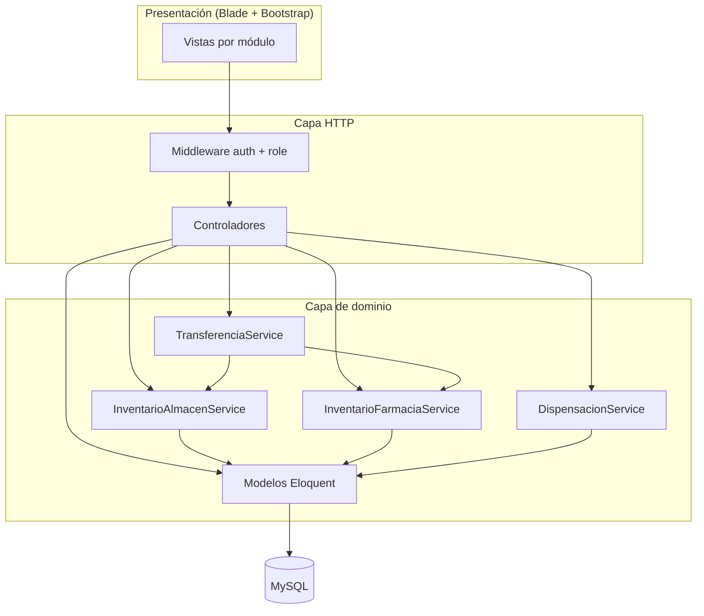
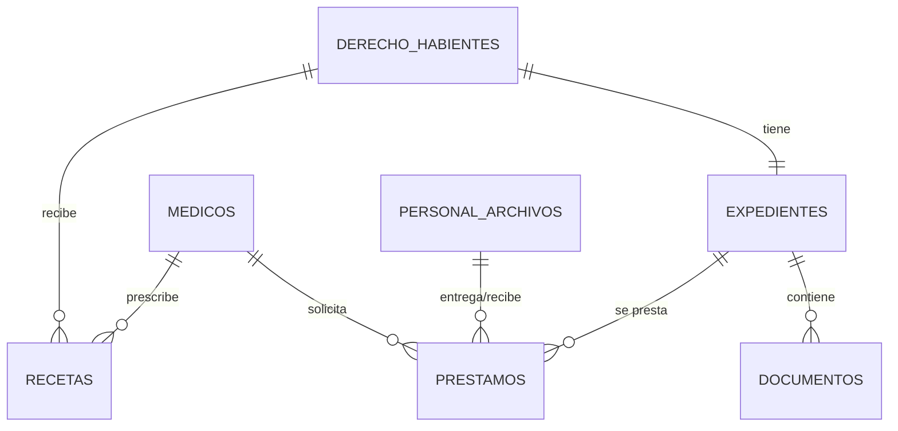
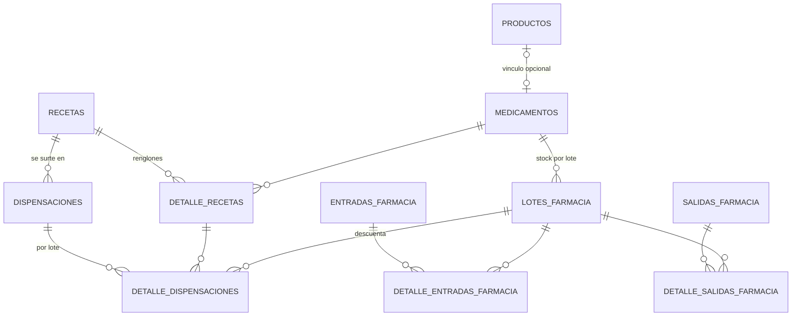
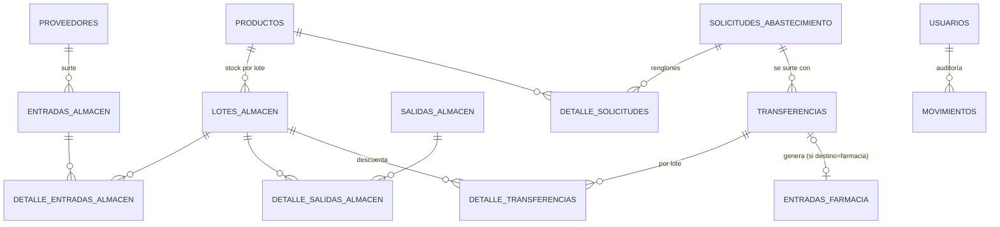
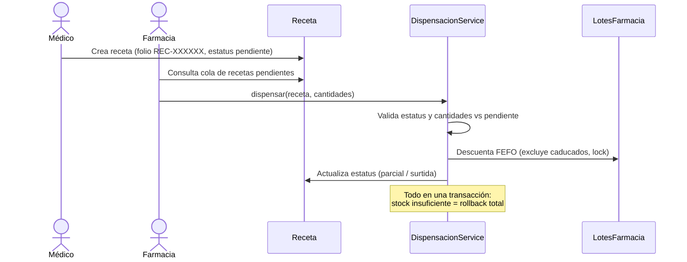
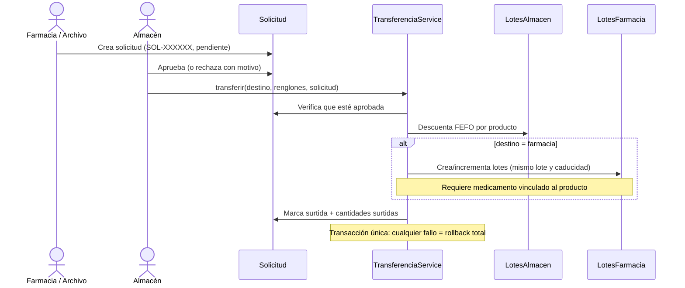

# Diseño del Sistema Integral de Gestión
## Farmacia · Almacén · Archivo Clínico

**Stack:** Laravel 12 · PHP 8.2 · MySQL (producción) / SQLite en memoria (tests) · Blade + Bootstrap 5

---

## 1. Arquitectura

Arquitectura **MVC + capa de servicios** en un monolito modular. Los módulos comparten una sola
base de datos y se comunican mediante **servicios internos** (clases en `app/Services/`), no por
HTTP: esto permite que una operación entre módulos (por ejemplo, una transferencia de almacén que
alimenta el stock de farmacia) ocurra dentro de **una sola transacción de base de datos**.



### Decisiones de diseño

| Decisión | Alternativa descartada | Razón |
|---|---|---|
| Stock a nivel **lote** (`cantidad_actual` por lote; stock total = suma) | Columna `stock` en el catálogo | Evita desincronización, habilita FEFO y reportes de caducidad triviales |
| Descuento **FEFO** (*First Expired, First Out*) con `lockForUpdate()` en transacción | FIFO / manual | Los medicamentos caducan; debe salir primero lo que caduca antes. El lock evita carreras |
| **Servicios internos** para integración | API HTTP interna | Monolito con una BD: la transacción atómica entre módulos es imposible con HTTP |
| **Un guard** de sesión con modelo `Usuario` | Guard adicional / tabla `users` | La tabla `usuarios` ya existía con FK desde auditoría (`movimientos`); un guard mantiene `Auth::id()` consistente |
| Vínculo `medicamentos.id_producto` | Catálogo único compartido | Farmacia y almacén tienen atributos distintos; el vínculo opcional habilita transferencias |

---

## 2. Módulos y sus tablas

| Módulo | Tablas propias |
|---|---|
| **Archivo Clínico** | `derecho_habientes`, `expedientes`, `documentos`, `prestamos`, `medicos`, `personal_archivos` |
| **Farmacia** | `medicamentos`, `lotes_farmacia`, `recetas`, `detalle_recetas`, `dispensaciones`, `detalle_dispensaciones`, `entradas_farmacia`, `detalle_entradas_farmacia`, `salidas_farmacia`, `detalle_salidas_farmacia` |
| **Almacén** | `proveedores`, `productos`, `lotes_almacen`, `entradas_almacen`, `detalle_entradas_almacen`, `salidas_almacen`, `detalle_salidas_almacen` |
| **Integración** | `solicitudes_abastecimiento`, `detalle_solicitudes_abastecimiento`, `transferencias`, `detalle_transferencias` |
| **Administración** | `usuarios`, `movimientos` (auditoría) |

---

## 3. Diagrama Entidad-Relación

### 3.1 Archivo Clínico



### 3.2 Farmacia



### 3.3 Almacén e integración



---

## 4. Autenticación y control de acceso

- Login propio (`/login`) contra la tabla `usuarios` (`nombre_usuario` + contraseña, hash bcrypt
  vía cast `hashed` del modelo).
- Middleware `auth` protege todo el sistema; `role:<roles>` restringe por sección.
- El rol **administrador** tiene acceso implícito a todo (lo concede el middleware `VerificarRol`).
- El trait `RegistraMovimiento` registra crear/editar/eliminar en `movimientos` con el usuario en sesión.

### Matriz de acceso por rol

| Sección | administrador | archivo | medico | farmacia | almacen |
|---|:---:|:---:|:---:|:---:|:---:|
| Derechohabientes / Expedientes / Documentos | CRUD | CRUD | ver | — | — |
| Préstamos / Médicos / Personal Archivo | CRUD | CRUD | — | — | — |
| Recetas: crear / cancelar | ✔ | — | ✔ | — | — |
| Recetas: ver cola | ✔ | — | ✔ | ✔ | — |
| Medicamentos / Entradas-Salidas Farmacia / Dispensaciones / Alertas | ✔ | — | — | ✔ | — |
| Solicitudes: crear | ✔ | ✔ | — | ✔ | — |
| Solicitudes: aprobar / rechazar / surtir | ✔ | — | — | — | ✔ |
| Proveedores / Productos / Entradas-Salidas Almacén / Transferencias / Reporte existencias | ✔ | — | — | — | ✔ |
| Usuarios / Auditoría | ✔ | — | — | — | — |

---

## 5. Flujos de integración

### 5.1 Receta → Dispensación (Archivo Clínico → Farmacia)



### 5.2 Solicitud → Transferencia (Farmacia/Archivo → Almacén)



### 5.3 Estados

- **Receta:** `pendiente → parcial → surtida`; `pendiente → cancelada` (solo sin surtir).
- **Solicitud:** `pendiente → aprobada → surtida`; `pendiente → rechazada` (con motivo obligatorio).
- **Préstamo (existente):** `pendiente → devuelto`; `pendiente → vencido` (automático por fecha).

---

## 6. Reglas de negocio clave

1. **FEFO:** toda salida de stock (dispensación, salida de almacén, transferencia) descuenta primero
   el lote con caducidad más próxima. Lotes caducados nunca se dispensan.
2. **Atomicidad:** los movimientos multi-renglón son todo-o-nada (`DB::transaction` +
   `ValidationException` revierte todo si falta stock en cualquier renglón).
3. **Stock mínimo:** el reporte de existencias (almacén) y las alertas (farmacia) marcan productos
   en o bajo su `stock_minimo`.
4. **Transferencia a farmacia:** requiere que cada producto tenga `medicamento` vinculado
   (`medicamentos.id_producto`) y lotes con caducidad; crea automáticamente la entrada y los lotes
   de farmacia con el mismo número de lote.
5. **Módulo solicitante:** se deriva del rol del usuario autenticado, nunca del formulario.
6. **Folios:** `REC-`, `SOL-`, `TRF-` + id con ceros (asignados tras el insert, `updateQuietly`).
7. **Auditoría:** todo modelo de negocio con el trait `RegistraMovimiento` deja rastro en
   `movimientos` (usuario, acción, tabla, registro, fecha).

---

## 7. Estructura de código

```
app/
├── Http/
│   ├── Controllers/          # 1 controlador por recurso + Auth/LoginController
│   └── Middleware/VerificarRol.php
├── Models/                   # Eloquent; constantes de estatus, scopes, helpers
├── Services/
│   ├── InventarioAlmacenService.php    # entradas, salidas, descontarFefo()
│   ├── InventarioFarmaciaService.php   # entradas/salidas farmacia, entrada por transferencia
│   ├── DispensacionService.php         # dispensar recetas FEFO
│   └── TransferenciaService.php        # transferencias almacén → farmacia/área
└── Traits/RegistraMovimiento.php       # auditoría automática

routes/web.php                # grupos por middleware role:
resources/views/<recurso>/    # index / create / edit / show (+ _form parciales)
database/
├── migrations/               # esquema completo
├── factories/                # 1 por modelo (tests)
└── seeders/                  # UsuarioSeeder, CatalogoSeeder, InventarioDemoSeeder
tests/Feature/                # por módulo: Auth, Almacen, Farmacia, ArchivoClinico
```

---

## 8. Pruebas

- Corren contra **SQLite en memoria** (`phpunit.xml`), con `RefreshDatabase`.
- Helper `actingAsRol('<rol>')` en `tests/TestCase.php` crea y autentica un usuario del rol.
- Cobertura: autenticación, matriz de acceso por rol (403), reglas FEFO, atomicidad de
  transferencias, máquina de estados de solicitudes y recetas, alertas de caducidad y stock mínimo,
  auditoría.

Ejecución:

```bash
php artisan test
```
